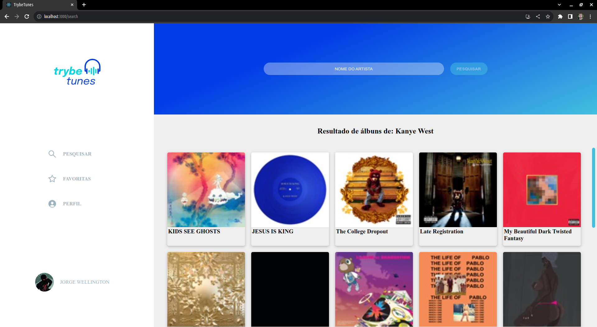

# Sejam bem-vindos ao projeto TrybeTunes!! 🎵💽

#### O TrybeTunes é um projeto que oferece uma experiência de simulação de um site de música, permitindo aos usuários pesquisar álbuns de artistas, ouvir prévias de músicas, marcar suas faixas favoritas e personalizar seus perfis. É uma plataforma interativa para os amantes da música explorarem e curtirem suas canções favoritas.

  

## Tecnologias :

<ul>
  <li>HTML</li>
  <li>Sass</li>
  <li>Java Script</li>
  <li>React</li>
  <li>React Router Dom</li>
</ul>

## Funcionalidades:

- Possível buscar álbuns de artistas.
- Possível visualizar previa de músicas de ábum específico.
- Possível favoritas músicas.
- Possível editar credências do perfil do usuário.

## Como executar:

- Clone em seu computador (via SHH).
- Abra um novo terminal em seu VSCode.   
- Execute o comando para instalar dependências: `npm install`.
- Para incializar execute o comando: `npm start`.

## Também disponível em:

### <a href="https://trybetunes-sooty.vercel.app/" ><b>TrybeTunes</b></a>

## Como contribuir no projeto:
  1. Faça um **fork** do projeto;
  2. Crie uma nova branch com as suas alterações: `git checkout -b my-feature`;
  3. Salve as alterações e crie uma mensagem de commit contando o que você fez: `git commit -m "feature: My new feature"`;
  4. Envie as suas alterações: `git push origin my-feature`;
  5. Abra o seu pull-request na página do GitHub.  

## Licença:

 Esse projeto está sob a licença: 

 

 ##  Autores:

### <a href="https://www.linkedin.com/in/jorge-reis-dev/" ><b>Jorge Wellington.</b></a>
